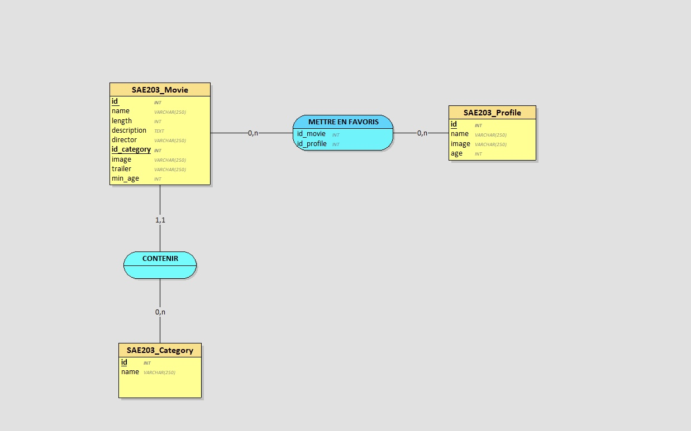

## Explication requêtes SQL et organisation des tables

Itération 1 : Consulter la liste des films proposés par la plateforme
- Fonction : getAllMovies()
- Requête SQL : 
SELECT m.id, m.name, m.image, m.id_category, c.name AS  category__name 
            FROM `SAE203_Movie` m
            JOIN `SAE203_Category` c ON m.id_category = c.id
- Cette requête me permet d'aller récupérer que certaines informations à propos des films de ma base de données. Le petit m me permet de récupérer le nom de mon film présent dans la table SAE203_Movie et donc de ne pas me mélanger avec le nom de ma catégorie car ils s'appellent tous les deux name. Ainsi, le petit c fait appel à la table SAE203_category. Je l'ai finalement même renommé par category__name pour éviter toutes confusion. Il y a un JOIN pour aller récupérer le nom de la catégorie associé à chacun des films, sans ça cela affiche le numéro de l'id du film. Le JOIN associe la clé étrangère id_category de la table SAE203_Movie avec la clé primaire id de la table SAE203_category.  

- Fonction : getAllCategories()
- Requête SQL : SELECT id, name from `SAE203_Category` ORDER BY name ASC
- Cette requête me permet de récupérer dans la table SAE_203_Category que l'identifiant et le nom du film grâce au SELECT id, name. Elle me permet aussi de classer les catégories par ordre alphabétique.

Itération 2 : Ajouter des films dans la base de données 
- Fonction : AddMovie($name, $year, $length, $description, $director, $id_category, $image, $trailer, $min_age)
- Requête SQL : INSERT INTO `SAE203_Movie` (`name`, `year`, `length`, `description`, `director`, `id_category`, `image`, `trailer`, `min_age`) VALUES (:name, :year, :length, :description, :director, :id_category, :image, :trailer, :min_age)
- Cette requête me permet de récupérer les valeurs rentrées dans mon formulaire admin afin de les insérer dans ma table SAE203_Movie. Le INSERT INTO SAE203_Movie indique que je souhaite créer une nouvelle ligne dans ma table SAE203_Movie. Entre parenthèses, j'ai indiqué tous les champs de ma table que je souhaite remplir. En faisant ça, j'ai veillé à ce que l'ordre soit le même pour les valeurs qui suivent. Et pour finir, VALUES (...) me permet d'indiquer toutes les valeurs que je souhaite insérer dans ma nouvelle ligne pour chacun des champs.

- Fonction : getAllCategories()
- Requête SQL : SELECT id, name from `SAE203_Category` ORDER BY name ASC
- Cette requête me permet de récupérer dans la table SAE_203_Category que l'identifiant et le nom du film grâce au SELECT id, name. Elle me permet aussi de classer les catégories par ordre alphabétique. Ainsi, l'utilisateur peut choisir une catégorie facilement pour pouvoir ajouter son film dans la base de données.

Itération 3 : Consulter les informations détaillées d'un film ainsi que son trailer
- Fonction : getMovieById($id)
- Requête SQL :
SELECT SAE203_Movie.*, SAE203_Category.name AS category__name
            FROM SAE203_Movie 
            INNER JOIN SAE203_Category ON SAE203_Movie.id_category = SAE203_Category.id 
            WHERE SAE203_Movie.id = :id
- Contrairement à la requête de l'itération 1, cette requête me permet d'aller récupérer toutes les informations de chacun des films grâce à l'astérisque du SELECT *. Le JOIN me permet d'être sûre que mon film a une catégorie valide, sinon le film ne s'affichera pas. Le marqueur :id, lui, me permet d'être sûre d'afficher les détails du bon film.

Itération 4 : Afficher les films en les regroupant par catégorie
- Fonction : getAllMovies()
- Requête SQL : 
SELECT m.id, m.name, m.image, m.id_category, c.name AS  category__name 
            FROM `SAE203_Movie` m
            JOIN `SAE203_Category` c ON m.id_category = c.id
            ORDER BY c.name ASC
- Pour cette itération, j'ai juste modifié la requête de la fonction getAllMovies. J'ai rajouté à la fin de la requête "ORDER BY c.name ASC qui me permet de ranger les films par ordre alphabétique de leur catégorie. 

Itération 5 : Avoir un formulaire pour ajouter des profils utilisateurs
- Fonction : AddProfile($name, $image, $age)
- Requête SQL : INSERT INTO `SAE203_Profile` (`name`, `image`, `age`) VALUES (:name, :image, :age)
- Cette requête me permet d'ajouter une nouvelle ligne dans ma table SAE203_Profile. (`name`, `image`, `age`): définissent les champs que le formulaire doit remplir. Ainsi, VALUES (:name, :image, :age) récupère les donner rentrées dans le formulaire et incère ses valeurs dans les bonne colonnes de ma nouvelle ligne dans la table.  

- Comme écrit sur le sujet, j'ai donc du créer une table SAE203_Profile. Dans ma table, je n'ai mis que les informations nécessaires comme le nom du profil (name), son age (age) et j'ai rajouté le nom de l'image de l'avatar (image).  
Pour le nom, j'ai mis un varchar de 250 caractères, la personne a un large choix de possibilité. Le nom peut être super long et composé de caractères spéciaux, de chiffres, comme de lettres. 
Pour l'âge, j'ai mis un entier (INT). La personne peut rentré son âge en chiffre comme ça. 
Pour l'image, j'ai également mis un varchar de 250. Les noms des photos enregistrées peuvent être très long si la personne oublie de le renommer. 

Itération 6 : Pouvoir choisir un profil utilisateur 
- Fonction : getProfiles()
- Requête SQL : SELECT id, name, image, age FROM `SAE203_Profile`
- Cette requête me permet de récupérer que les informations importantes c'est à dire l'id, le nom, l'age et le nom de l'image. Actuellement, on aurait pu faire un SELECT *, parce que la table SAE203_Profile ne contient que ces informations là. Mais si dans le futur on vient à rajouter des éléments dans la table, nous aurons toujours que les informations nécessaires au lieu d'avoir le chargemeny de toutes les informations.  

Itération 7 : Filtrer les contenus selon l'âge du profil sélectionné
- Function : getAllMovies($age = 0)
- Requête SQL : SELECT m.id, m.name, m.image, m.id_category, c.name AS category__name 
            FROM `SAE203_Movie` m
            JOIN `SAE203_Category` c ON m.id_category = c.id
            WHERE m.min_age <= :age
            ORDER BY c.name ASC"
- Pour cette itération, j'ai à nouveau modifié la fonction getAllMovie. J'ai rajouté WHERE m.min_age <= :age. La partie (<= :age) me permet de comparer cette valeur à la valeur (m.min_age). Si l'age du profil (:age) est de 16ans, cela n'affichera que les film dont le min_age (m.min_age) est inférieur ou égal à 16ans. 

Itération 8 : Pouvoir modifier un profil utilisateur
- Fonction : UpdateProfile($id, $name, $image, $age)
- Requête SQL : UPDATE `SAE203_Profile` SET `name` = :name, `image` = :image, `age` = :age WHERE `id` = :id"
- Cette requête me permet de modifier les informations du profil (name, image, age) en ciblant son id. La requête commence par UPDATE SAE203_Profile, elle me permet de modifier une ligne déjà existante dans ma table SAE203_Profile. La partie SET ... me permet de remplacer les anciennes valeurs par les nouvelles. J'ai remis toutes les valeurs, c'est à dire que l'utilisateurs peu tout changer. Si je retire un des éléments de SET comme l'age, la personne ne pourra pas modifier son age (mais ce n'était pas le but dans l'itération). 

Itération 9 : Pouvoir ajouter des films à une liste de favoris par profil utilisateur 
- Fonction : addFavorite($id_profile, $id_movie)
- Requête SQL : INSERT INTO `SAE203_Favorite` (`id_profile`, `id_movie`) VALUES (:id_profile, :id_movie)
- Cette requête me permet de lier un film à un utilisateur grâce aux id. La requête commence par INSERT INTO qui me permet de créer une nouvelle association. Elle va lier un id d'un film avec un id d'un profil. 

- Fonction : getFavorite($id_profile)
- Requête SQL : SELECT m.id, m.name, m.image, m.id_category, c.name AS category__name 
            FROM `SAE203_Favorite` f
            JOIN `SAE203_Movie` m ON f.id_movie = m.id
            JOIN `SAE203_Category` c ON m.id_category = c.id
            WHERE f.id_profile = :id_profile
- Cette requête me permet de récupérer les films que l'utilisateur a mis en favoris. La partie JOIN : le premier JOIN va dans ma table SAE203_Movie grâce au petit m pour récupérer le nom et le nom de l'image du film grâce à l'id. 
Le deuxième JOIN va dans ma table SAE203_Category grâce au petit c pour récupérer le nom de la catégorie du film au lieu d'avoir simplement le numéro de l'id.
La partie WHERE f.id_profile = :id_profile me permet d'afficher que les favoris du profil sélectionné, sinon j'aurais tous les favoris de tous les profils. 

- Fonction : readFavorites($id_profile)
- Requête SQL : SELECT m.* FROM SAE203_Movie m 
            JOIN SAE203_Favorite f ON m.id = f.id_movie 
            WHERE f.id_profile = :id_profile
- Cette requête me permet de slélectionner toutes les colonnes de ma table SAE203_Movie grâce au petit m. La partie JOIN SAE203_Favorite f ON m.id = f.id_movie me permet de faire le lien avec ma table SAE203_Favorite et de faire correspondre l'id du film avec l'id enregistré dans la table favoris. La partie WHERE f.id_profile = :id_profile me sert de "filtre'" pour ne retirer que le film aimé par ce profil. 

- Pour cette itération, j'ai du créer une nouvelle table: SAE203_Favorite. Dans ma table, j'ai mis deux id : id_profile et id_movie. l'id_profile me permet de désigner le profil qui a aimé le film et l'id_movie permet de désigner quel film a été aimé. Comme ce sont des id, ils sont tous les deux de types INT. 

Itération 10 : Pouvoir retirer un film de sa liste de favoris
- Fonction : removeFavorite($id_profile, $id_movie)
- Requête SQL : DELETE FROM `SAE203_Favorite` WHERE `id_profile` = :id_profile AND `id_movie` = :id_movie
- Cette requête me permet de retirer le film de la liste. La requête commence par DELETE FROM `SAE203_Favorite`, cela me permet de supprimer une ligne de ma table SAE203_Favorite. La partie WHERE `id_profile` = :id_profile AND `id_movie` = :id_movie me permet de cibler exactement ce que je veux retirer de ma table, d'abord le profil et après le film. Cette partie me permet de retirer qu'une seule liaisons et pas tous les films favoris de ce profil. 

Itération 11 : Avoir des films mis en avant 
- Fonction : getFeaturedMovies()
- Requête SQL : SELECT * FROM `SAE203_Movie` WHERE featured = 1
- Cette requête me permet de sélectionner tous les éléments de ma atble SAE203_Movie. La partie WHERE featured = 1 me permet de n'afficher que les lignes où la colonne featured possède un 1. 

### Capture d'écran de la vue Looping

### Explication des cardinalités

Category 0,n <-> Contenir <-> 1,1 Movie : 
Selon mon formulaire, je n'ai pas laisser la possibilité de choisir plusiers catégories : 
- Un film peut être contenu au minimum à 1 catégorie et au maximum à 1 catégorie. 
- Une catégorie peut contenir au minimum 0 film et au maximum plusieurs films. 

Movie 0,n <-> Mettre en favoris <-> 0,n Profile :
- Un film peut être mis en favoris par au minimum 0 profil et au maximum par plusieurs profils. 
- Un profil peut avoir mis au minimum 0 film ou au maximum plusieurs films en favoris. 

