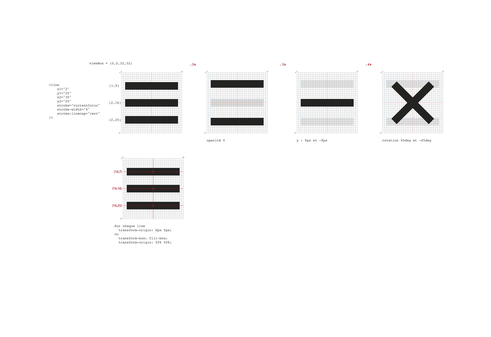

# TD — Animations et interactions CSS sans JavaScript

> Les transitions, les transformations SVG et le "Checkbox Hack" pour créer des interfaces interactives entièrement en CSS.

---

## Exercice 1 — Comprendre `transform-origin`

La propriété `transform-origin` définit **l'origine** (point de pivot) autour duquel une transformation (`rotate`, `scale`, etc.) s'effectue.

### Différence HTML vs SVG

|                                   | Élément HTML (`<div>`)    | Élément SVG (`<rect>`, `<line>`)            |
| --------------------------------- | ------------------------- | ------------------------------------------- |
| **`transform-origin` par défaut** | `center center` (50% 50%) | `0 0` (coin haut-gauche **du canevas SVG**) |
| **Repère des `%`**                | L'élément lui-même        | Le `viewBox` du SVG parent                  |

> [!WARNING]
> C'est le piège principal : sur un élément SVG, écrire `transform-origin: 50% 50%` pointe vers le centre **du SVG**, pas de la forme !

### Solutions pour centrer le pivot sur un élément SVG

**Solution 1 — Calculer manuellement en pixels :**

```css
/* Pour une <line> allant de x1="2" y1="10" à x2="30" y2="10" */
.svg__line {
  transform-origin: 16px 10px; /* (2+30)/2 = 16, y = 10 */
}
```

**Solution 2 — Utiliser `transform-box: fill-box` (recommandé) :**

```css
.svg__line2 {
  transform-box: fill-box; /* Le repère = la forme elle-même */
  transform-origin: 50% 50%; /* Maintenant "center" fonctionne ! */
}
```

### Résumé

- **`transform-box: view-box`** (défaut SVG) → le repère est le viewBox.
- **`transform-box: fill-box`** → le repère est la "bounding box" de l'élément.

---

## Exercice 2 — Construire un bouton Hamburger SVG

### Le SVG du Hamburger

Le menu hamburger est composé de **3 lignes** dessinées dans un SVG de `viewBox="0 0 32 32"` :

```html
<button class="burger">
  <svg viewBox="0 0 32 32" width="400" height="400" class="burger__svg">
    <line
      class="burger__line"
      x1="2"
      y1="7"
      x2="30"
      y2="7"
      stroke="currentColor"
      stroke-width="4"
      stroke-linecap="round"
    />
    <line
      class="burger__line"
      x1="2"
      y1="16"
      x2="30"
      y2="16"
      stroke="currentColor"
      stroke-width="4"
      stroke-linecap="round"
    />
    <line
      class="burger__line"
      x1="2"
      y1="25"
      x2="30"
      y2="25"
      stroke="currentColor"
      stroke-width="4"
      stroke-linecap="round"
    />
  </svg>
</button>
```

### Points importants

- **`stroke="currentColor"`** : La couleur du trait hérite de la propriété CSS `color` du parent. Très pratique pour changer la couleur au hover.
- **`stroke-linecap="round"`** : Arrondit les extrémités des lignes.
- **`<button>`** : On utilise un `<button>` et non un `<div>` car c'est un élément interactif (accessibilité).

### Animation au `:hover` avec `transform-box: fill-box`



> [!TIP]
> Les `transition-delay` sont découpés pour provoquer un enchaînement : d'abord l'opacité, puis la translation, puis la rotation. Au retour (état normal), l'ordre s'inverse grâce à des délais différents.

---

## Exercice 3 — Le "Checkbox Hack" et les sélecteurs de frères

On exploite le mécanisme natif du navigateur : cliquer sur un `<label>` coche/décoche automatiquement l'`<input>` associé. En CSS, on détecte cet état avec `:checked`.

### Structure HTML minimale

```html
<div class="container">
  <input type="checkbox" id="toggle" />
  <label for="toggle" class="label">Toggle</label>
  <div class="control-me">Bla bla</div>
</div>
```

### Relier label et input

Il existe **deux méthodes** :

**Méthode explicite** (attribut `for` / `id`) :

```html
<input type="checkbox" id="toggle" /> <label for="toggle">Clique-moi !</label>
```

**Méthode implicite** (imbrication) :

```html
<label for="toggle">
  <input type="checkbox" id="toggle" />
  Clique-moi !
</label>
```

### Les 3 sélecteurs CSS essentiels

#### 1. Le combinateur de frère adjacent direct `+`

Cible **l'élément immédiatement après** :

```css
input[type="checkbox"]:checked + label {
  opacity: 0.5;
}
```

#### 2. Le combinateur de frères de même niveau `~`

Cible **tout élément frère qui suit** (pas forcément immédiatement) :

```css
input[type="checkbox"]:checked ~ .control-me {
  background-color: cadetblue;
}
```

#### 3. La pseudo-classe `:has()` (sélecteur de parent)

Permet de remonter et cibler un **parent** en fonction de ses enfants :

```css
body:has(input[type="checkbox"]:checked) {
  --fg: var(--color-white);
  --bg: var(--color-black);
}
```

> [!IMPORTANT]
> Avant `:has()`, il était **impossible** de modifier un élément parent en CSS. Cette pseudo-classe change tout : on peut bâtir un Dark/Light mode complet sans JS !

### Masquer la checkbox sans casser l'accessibilité

```css
input[type="checkbox"] {
  appearance: none;
  /* OU la technique sr-only */
}
```

> [!WARNING]
> Ne jamais utiliser `display: none` pour masquer la checkbox ! L'input serait retiré du flux d'accessibilité et ne serait plus atteignable au clavier (touche `Tab`).

---

## Exercice 4 — Hamburger animé piloté par une Checkbox

On combine l'exercice 2 (SVG hamburger) et l'exercice 3 (checkbox hack) : le clic sur le label coche la checkbox, ce qui déclenche l'animation du burger ☰ → ✕.

### Structure HTML

```html
<div class="container">
  <!-- 1. Checkbox cachée -->
  <input type="checkbox" id="toggle" />

  <!-- 2. Label = zone cliquable -->
  <label for="toggle" class="burger">
    <svg viewBox="0 0 32 32" width="64" height="64" class="burger__svg">
      <line class="burger__line" x1="2" y1="7" x2="30" y2="7" ... />
      <line class="burger__line" x1="2" y1="16" x2="30" y2="16" ... />
      <line class="burger__line" x1="2" y1="25" x2="30" y2="25" ... />
    </svg>
    <span class="sr-only">Menu</span>
  </label>

  <!-- 3. Élément contrôlé -->
  <div class="control-me"></div>
</div>
```

### Orchestration des transitions (aller / retour)

La clé de l'exercice est de jouer avec les `transition-delay` pour séquencer les animations.

**État normal → Checked (Aller) :**

```
1. translate les lignes vers le centre    (delay: 0s)
2. L'opacité de la ligne 2 passe à 0
3. rotate les lignes à ±45deg            (delay: 0.5s)
```

**État Checked → Normal (Retour) :**

```
1. rotate revient à 0                    (delay: 0s)
2. L'opacité réapparaît                  (delay: 0.4s)
3. translate revient à la position        (delay: 0.5s)
```

```css
/* -- État initial (transitions de RETOUR) -- */
.burger__line:nth-child(1) {
  transform-origin: 16px 7px;
  transition:
    translate 0.3s 0.5s,
    rotate 0.4s 0s;
}

/* -- État Checked (transitions d'ALLER) -- */
input[type="checkbox"]:checked ~ label .burger__line:nth-child(1) {
  translate: 0 9px;
  rotate: 45deg;
  transition-delay: 0s, 0.5s; /* Inverse les délais */
}
```

> [!TIP]
> L'astuce fondamentale : on déclare les `transition-delay` **deux fois**. Une fois sur l'état initial (= animation de retour) et une fois sur l'état `:checked` (= animation d'aller). Cela permet de séquencer différemment l'aller et le retour.

---

## Exercice 5 — Menu Off-Canvas (plein écran)

### Le concept

On pousse le Checkbox Hack plus loin : au lieu de juste grossir un `div`, on fait glisser une **navigation plein écran** (off-canvas) depuis le bord droit de l'écran.

### Structure HTML : ajout du `<nav>`

```html
<div class="container">
  <input type="checkbox" id="toggle" />
  <label for="toggle" class="burger">
    <svg ...><!-- Burger SVG --></svg>
    <span class="sr-only">Menu</span>
  </label>

  <!-- Navigation Off-Canvas -->
  <nav class="main-nav">
    <ul class="main-nav__list">
      <li class="main-nav__item"><a href="" class="main-nav__link">Home</a></li>
      <li class="main-nav__item"><a href="" class="main-nav__link">New</a></li>
      ...
    </ul>
  </nav>
</div>
```

### Le CSS de l'Off-Canvas

```css
/* Navigation cachée hors écran à droite */
.main-nav {
  position: fixed;
  inset: 0; /* Couvre tout le viewport */
  display: flex;
  justify-content: center;
  align-items: center;
  background-color: #4b476a;

  translate: 100% 0; /* Décalée de 100% vers la droite */
  transition: translate 0.4s 0.5s;
}

/* Quand la checkbox est cochée, le menu rentre */
input[type="checkbox"]:checked ~ .main-nav {
  translate: 0;
}
```

### Points clés

1. **`position: fixed` + `inset: 0`** : Le menu couvre tout l'écran.
2. **`translate: 100% 0`** : Le menu est poussé hors du viewport à droite.
3. **`z-index: 10` sur le label** : Le bouton burger reste cliquable au-dessus de la nav.
4. **`transition-delay`** sur le translate du nav : Le menu glisse après l'animation du burger.

### Animation du burger avec `<rect>`

Dans cet exercice, le burger utilise des **rectangles** (`<rect>`) au lieu de lignes. Le principe d'animation est le même mais on utilise la propriété SVG `y` pour déplacer les barres :

```css
input[type="checkbox"]:checked ~ .burger .burger__line:nth-child(1) {
  y: 15px; /* Les 3 rect se retrouvent au même y */
  rotate: 45deg;
}
```

> [!NOTE]
> L'attribut SVG `y` de `<rect>` est animable en CSS. C'est une alternative au `translate`, spécifique aux éléments SVG.

---

## Exercice 6 — Menu Off-Canvas responsive (version finale)

### Ce qui change

Cet exercice représente la **version aboutie** d'un menu responsive :

1. **Sémantique améliorée** : Structure avec un `<header>`, le checkbox est masqué avec la classe `sr-only`.
2. **CSS custom properties** pour les `translate` et `rotate` via `--_trans` et `--_rotate`.
3. **Media query `@media (min-width: 54em)`** pour afficher la navigation en desktop.

### Structure HTML finale

```html
<header class="header">
  <div class="header__logo">
    <div>Logo</div>
    <span class="sr-only">Nom de la compagnie</span>
  </div>

  <input type="checkbox" id="menu-toggle" class="sr-only" />
  <label for="menu-toggle" class="burger">
    <svg class="burger__svg" viewBox="0 0 32 32" width="32" height="32">
      <line class="burger__line" x1="2" y1="7" x2="30" y2="7" ... />
      <line class="burger__line" x1="2" y1="16" x2="30" y2="16" ... />
      <line class="burger__line" x1="2" y1="25" x2="30" y2="25" ... />
    </svg>
    <span class="sr-only">Menu</span>
  </label>

  <nav class="main-nav">
    <ul class="main-nav__list">
      ...
    </ul>
  </nav>
</header>
```

### CSS Custom Properties pour les animations

L'astuce avancée : chaque ligne de burger porte ses propres variables CSS :

```css
.burger__line:nth-child(1) {
  --_trans: 0 9px;
  --_rotate: 45deg;
  transform-origin: 16px 7px;
  transition:
    translate 0.2s ease-in-out 0.4s,
    rotate 0.2s ease-in-out 0.2s;
}

.burger__line:nth-child(3) {
  --_trans: 0 -9px;
  --_rotate: -45deg;
  transform-origin: 16px 25px;
  transition:
    translate 0.2s ease-in-out 0.4s,
    rotate 0.2s ease-in-out 0.2s;
}
```

Puis **un seul sélecteur** gère tous les checked :

```css
[type="checkbox"]:checked ~ .burger  .burger__line {
  translate: var(--_trans);
  rotate: var(--_rotate);
  transition:
    translate 0.2s ease-in-out 0.2s,
    rotate 0.2s ease-in-out 0.4s;
}
```

> [!TIP]
> Grâce aux custom properties, on évite de dupliquer les déclarations `translate` et `rotate` pour chaque ligne. Le code est beaucoup plus DRY (Don't Repeat Yourself).

### Off-Canvas partiel (`inset: 0 0 0 15%`)

Contrairement à l'exercice 4, le menu ne couvre pas tout l'écran : il laisse 15% de l'écran visible à gauche grâce à `inset: 0 0 0 15%`.

```css
.main-nav {
  position: fixed;
  inset: 0 0 0 15%; /* Laisse un espace à gauche */
  transform: translateX(100%);
  transition: transform 0.5s ease-in-out;
}
```

### Le passage en responsive (Desktop)

```css
@media (min-width: 54em) {
  .main-nav {
    position: static; /* Retourne dans le flux */
    background-color: transparent;
    transform: translateX(0); /* Plus besoin de glisser */
  }

  .main-nav__list {
    flex-direction: row; /* Navigation horizontale */
  }

  .burger {
    display: none; /* Cache le burger */
  }
}
```
