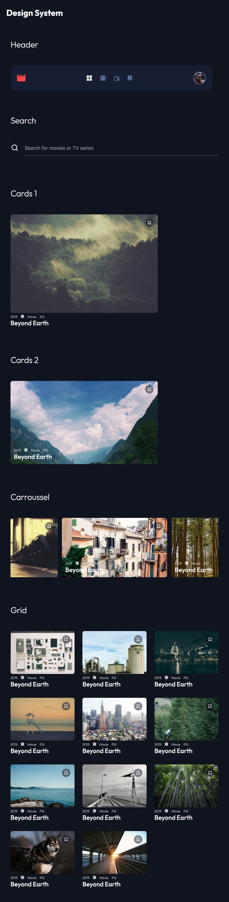

# TD S2 — Architecture CSS : BEM & limites

La gestion du CSS peut devenir difficile à mesure que les projets que vous construisez augmentent en taille et en complexité. Sans une structure et des conventions de dénomination claires, la base de code CSS peut devenir désorganisée, difficile à maintenir et sujette à des problèmes de **spécificité**. C'est là qu'interviennent les méthodologies et les architectures CSS - elles fournissent des lignes directrices et des meilleures pratiques pour écrire un CSS plus propre, plus modulaire et maintenable.

Les méthodologies CSS sont des moyens formalisés de structurer et d'organiser le code CSS. Ils définissent des conventions de dénomination de classe, des règles pour diviser CSS en modules et des directives pour écrire un code plus lisible et réutilisable.

Les principaux objectifs de l'utilisation d'une **méthodologie CSS** sont les suivants :

- Amélioration de la maintenabilité et de l'évolutivité de la base de code
- Réduction des problèmes de spécificité et des conflits de style
- Une meilleure compréhension de la relation entre HTML et CSS
- Lisibilité améliorée et collaboration plus facile avec d'autres développeurs

---

## 1. Rappel BEM

**BEM** est une méthodologie qui vise à aider les développeurs à mieux comprendre la relation entre HTML et CSS. C'est l'une des conventions de dénomination CSS les plus populaires et elle devient particulièrement utile lorsqu'elle est combinée avec des sélecteurs CSS imbriqués.
L'idée centrale derrière BEM est de diviser l'interface utilisateur en **blocs indépendants** ou **composants**. Les blocs peuvent avoir des éléments, et les blocs et les éléments peuvent avoir des modificateurs. Il en résulte des noms de classe faciles à comprendre et à maintenir.

- **Bloc** : Une entité autonome qui a du sens en soi.
  Les exemples pourraient être `nav, list, card`.
- **Element** : Une partie d'un bloc qui n'a pas de signification autonome et qui est sémantiquement liée à son bloc.
  Des exemples pourraient être `nav__item, list__item, card__title`.
- **Modifier** : variante de style ou d'état (pour changer l'apparence ou le comportement).
  Les exemples peuvent être `*--selected, *--disabled, *--highlighted, *--checked`.
- Pas de descendance dans les noms : `post-card__body__title` ❌ → `post-card__title` ✅

---

## 2. Mise en pratique BEM

➡️ Nommer les classes de ce composant HTML en utilisant la méthode BEM :

```html
<!-- ⚠️ Le badge est un block instancié dans la card ou pas -->
<article>
  <header>
    
    <div>
      <h3>Prénom NOM</h3>
      <span>Admin</span>
    </div>
  </header>
  ...
</article>
```

**Contraintes :**

- Nommage BEM strict
- Le badge "Admin" : réfléchir d'abord à sa nature — est-ce un élément de la card ou un composant autonome ?

> [WARNING]
> Avant de nommer une classe, posez-vous cette question :
> _"Est-ce que ce composant peut exister seul, sur une autre page, dans un autre contexte ?"_
>
> - **Oui** → c'est un **block** indépendant
> - **Non** → c'est un **element** (`__`) du block parent

**Cas du badge :** un badge de rôle (Admin, Éditeur, Invité…) peut tout à fait apparaître dans un tableau d'utilisateurs, une liste de membres, un header... Il a une existence propre → **c'est un block**.

```html
<!-- ✅ Le badge est un block instancié dans la card -->
<article class="user-card user-card--admin">
  <header class="user-card__header">
    
    <div class="user-card__meta">
      <h3 class="user-card__name">Prénom NOM</h3>
      <span class="badge badge--admin">Admin</span>
    </div>
  </header>
  ...
</article>
```

Le modifier `--admin` est porté par le **block `user-card`** : il décrit l'état global de la carte, et peut potentiellement influencer plusieurs éléments enfants (bordure colorée, fond, icône…). Le `badge` est lui-même un block avec son propre modifier.

```css
/* Block user-card */
.user-card { ...
  .user-card__header { display: flex; align-items: center; gap: 1rem; }
  .user-card__avatar { width: 60px; height: 60px; border-radius: 50%; }
  .user-card__meta { display: flex; align-items: center; gap: .5rem; }
  .user-card__name { font-weight: bold; }
  .user-card__email { color: gray; }
  .user-card__btn { ... }
  &.user-card--admin { border-color: royalblue; } /* le modifier agit sur le block entier */
}

/* Block badge — indépendant, réutilisable partout */
.badge {
  padding: .2rem .6rem;
  border-radius: .25rem;
  font-size: .75rem;
  &.badge--admin { background: royalblue; color: white; }
  &.badge--editor { background: seagreen; color: white; }
}
```

---

## 3. Bilan des limites de BEM

> _"Imaginez que vous avez 20 composants sur la page. Que se passe-t-il ?"_

- Les styles globaux (couleurs, espacements, typographie) sont **répétés** dans chaque block
- Si le design change, il faut modifier **chaque fichier** de composant
- Deux composants côte à côte ne partagent aucun code → risque de **duplication**

> _"Comment gérez-vous les espacements entre composants ?"_

- BEM n'a pas de réponse claire pour la mise en page globale
- On finit par créer des classes `wrapper`, `section`, `layout` hors BEM → **incohérence**

### Tableau de synthèse à construire avec les étudiants

| Ce que BEM fait bien          | Ce que BEM ne résout pas       |
| ----------------------------- | ------------------------------ |
| Nommage clair et prévisible   | Styles globaux partagés        |
| Encapsulation du composant    | Espacement entre composants    |
| Évite les conflits de classes | Duplication des règles de base |

> **Transition :** _"CUBE CSS propose une architecture qui garde BEM pour les composants, mais ajoute des couches pour répondre à ces manques."_

## Exercice : Design system avec BEM

Intégration de **chaque composant** avec la méthodologie BEM (Block Element Modifier) pour une meilleure organisation et maintenabilité du code.



> [!TIP]
> Pour le carrousel regardez la propriété `scroll-snap` en CSS, qui permet de faire du scroll "aimanté" pour créer des carrousels natifs sans JavaScript.

### Font

```css
font : Outfit
font-weight: 300 400 500
font-size :
.81rem
.93rem
1rem
1.125rem
1.5rem
2rem
```

### Color

```css
--red: 0 97% 63%;
--dark-blue: 223 30% 9%;
--semi-dark-blue: 223 36% 14%;
--grey: 223 23% 46%;
--white: 0 0% 100%;
```

### SVG

### Logo

<svg width="33" height="27" viewBox="0 0 33 27" xmlns="http://www.w3.org/2000/svg"><path d="m26.463.408 3.2 6.4h-4.8l-3.2-6.4h-3.2l3.2 6.4h-4.8l-3.2-6.4h-3.2l3.2 6.4h-4.8l-3.2-6.4h-1.6a3.186 3.186 0 0 0-3.184 3.2l-.016 19.2a3.2 3.2 0 0 0 3.2 3.2h25.6a3.2 3.2 0 0 0 3.2-3.2V.408h-6.4Z" fill="#FC4747"></path></svg>

<svg width="20" height="20" viewBox="0 0 20 20" xmlns="http://www.w3.org/2000/svg"><path d="M8 0H1C.4 0 0 .4 0 1v7c0 .6.4 1 1 1h7c.6 0 1-.4 1-1V1c0-.6-.4-1-1-1Zm0 11H1c-.6 0-1 .4-1 1v7c0 .6.4 1 1 1h7c.6 0 1-.4 1-1v-7c0-.6-.4-1-1-1ZM19 0h-7c-.6 0-1 .4-1 1v7c0 .6.4 1 1 1h7c.6 0 1-.4 1-1V1c0-.6-.4-1-1-1Zm0 11h-7c-.6 0-1 .4-1 1v7c0 .6.4 1 1 1h7c.6 0 1-.4 1-1v-7c0-.6-.4-1-1-1Z" fill="#5A698F"></path></svg>

<svg width="20" height="20" viewBox="0 0 20 20" xmlns="http://www.w3.org/2000/svg"><path d="M20 4.481H9.08l2.7-3.278L10.22 0 7 3.909 3.78.029 2.22 1.203l2.7 3.278H0V20h20V4.481Zm-8 13.58H2V6.42h10v11.64Zm5-3.88h-2v-1.94h2v1.94Zm0-3.88h-2V8.36h2v1.94Z" fill="#5A698F"></path></svg>

<svg width="20" height="20" viewBox="0 0 20 20" xmlns="http://www.w3.org/2000/svg"><path d="M16.956 0H3.044A3.044 3.044 0 0 0 0 3.044v13.912A3.044 3.044 0 0 0 3.044 20h13.912A3.044 3.044 0 0 0 20 16.956V3.044A3.044 3.044 0 0 0 16.956 0ZM4 9H2V7h2v2Zm-2 2h2v2H2v-2Zm16-2h-2V7h2v2Zm-2 2h2v2h-2v-2Zm2-8.26V4h-2V2h1.26a.74.74 0 0 1 .74.74ZM2.74 2H4v2H2V2.74A.74.74 0 0 1 2.74 2ZM2 17.26V16h2v2H2.74a.74.74 0 0 1-.74-.74Zm16 0a.74.74 0 0 1-.74.74H16v-2h2v1.26Z" fill="#5A698F"></path></svg>

<svg width="17" height="20" viewBox="0 0 17 20" xmlns="http://www.w3.org/2000/svg"><path d="M15.387 0c.202 0 .396.04.581.119.291.115.522.295.694.542.172.247.258.52.258.82v17.038c0 .3-.086.573-.258.82a1.49 1.49 0 0 1-.694.542 1.49 1.49 0 0 1-.581.106c-.423 0-.79-.141-1.098-.423L8.46 13.959l-5.83 5.605c-.317.29-.682.436-1.097.436-.202 0-.396-.04-.581-.119a1.49 1.49 0 0 1-.694-.542A1.402 1.402 0 0 1 0 18.52V1.481c0-.3.086-.573.258-.82A1.49 1.49 0 0 1 .952.119C1.137.039 1.33 0 1.533 0h13.854Z" fill="#5A698F"></path></svg>

### Search

<svg width="32" height="32" viewBox="0 0 32 32" xmlns="http://www.w3.org/2000/svg"><path d="M27.613 25.72 23.08 21.2a10.56 10.56 0 0 0 2.253-6.533C25.333 8.776 20.558 4 14.667 4S4 8.776 4 14.667c0 5.89 4.776 10.666 10.667 10.666A10.56 10.56 0 0 0 21.2 23.08l4.52 4.533a1.333 1.333 0 0 0 1.893 0 1.333 1.333 0 0 0 0-1.893ZM6.667 14.667a8 8 0 1 1 16 0 8 8 0 0 1-16 0Z" fill="#FFF"></path></svg>

### Btn

<svg width="30" height="30" viewBox="0 0 30 30"  xmlns="http://www.w3.org/2000/svg"><path d="M15 0C6.713 0 0 6.713 0 15c0 8.288 6.713 15 15 15 8.288 0 15-6.712 15-15 0-8.287-6.712-15-15-15Zm-3 21V8l9 6.5-9 6.5Z" fill="#FFF"></path></svg>

### Bookmark

<svg width="12" height="14" viewBox="0 0 12 14" fill="none" xmlns="http://www.w3.org/2000/svg"><path d="M10.9816 1L11 13L6 9L1 13V1.036L10.9816 1Z" stroke="currentColor" stroke-width="1.5" stroke-linejoin="round"/></svg>

### Pellicule

<svg width="12" height="12" xmlns="http://www.w3.org/2000/svg"><path d="M10.173 0H1.827A1.827 1.827 0 0 0 0 1.827v8.346C0 11.183.818 12 1.827 12h8.346A1.827 1.827 0 0 0 12 10.173V1.827A1.827 1.827 0 0 0 10.173 0ZM2.4 5.4H1.2V4.2h1.2v1.2ZM1.2 6.6h1.2v1.2H1.2V6.6Zm9.6-1.2H9.6V4.2h1.2v1.2ZM9.6 6.6h1.2v1.2H9.6V6.6Zm1.2-4.956V2.4H9.6V1.2h.756a.444.444 0 0 1 .444.444ZM1.644 1.2H2.4v1.2H1.2v-.756a.444.444 0 0 1 .444-.444ZM1.2 10.356V9.6h1.2v1.2h-.756a.444.444 0 0 1-.444-.444Zm9.6 0a.444.444 0 0 1-.444.444H9.6V9.6h1.2v.756Z" fill="currentColor" opacity="0.75"></path></svg>

```html
<!-- SPRITE SVG -->
<svg
  aria-hidden="true"
  style="position: absolute; width: 0; height: 0; overflow: hidden;"
  version="1.1"
  xmlns="http://www.w3.org/2000/svg"
  xmlns:xlink="http://www.w3.org/1999/xlink"
>
  <symbol
    id="icon-logo"
    viewBox="0 0 24 24"
    fill="none"
    xmlns="http://www.w3.org/2000/svg"
  >
    <path
      d="M18 4L20 7.95767H17L15 4H13L15 7.95767H12L10 4H8L10 7.95767H7L5 4H4C3.73787 4.00016 3.47836 4.05153 3.23634 4.15115C2.99432 4.25078 2.77457 4.3967 2.58968 4.58055C2.40479 4.7644 2.25841 4.98256 2.15894 5.22251C2.05946 5.46246 2.00885 5.71948 2.01 5.97884L2 17.8519C2 18.3767 2.21071 18.88 2.58579 19.2511C2.96086 19.6222 3.46957 19.8307 4 19.8307H20C20.5304 19.8307 21.0391 19.6222 21.4142 19.2511C21.7893 18.88 22 18.3767 22 17.8519V4H18Z"
      fill="currentColor"
    />
  </symbol>

  <symbol
    id="icon-window"
    viewBox="0 0 24 24"
    fill="none"
    xmlns="http://www.w3.org/2000/svg"
  >
    <path
      d="M10 2H3C2.4 2 2 2.4 2 3V10C2 10.6 2.4 11 3 11H10C10.6 11 11 10.6 11 10V3C11 2.4 10.6 2 10 2ZM10 13H3C2.4 13 2 13.4 2 14V21C2 21.6 2.4 22 3 22H10C10.6 22 11 21.6 11 21V14C11 13.4 10.6 13 10 13ZM21 2H14C13.4 2 13 2.4 13 3V10C13 10.6 13.4 11 14 11H21C21.6 11 22 10.6 22 10V3C22 2.4 21.6 2 21 2ZM21 13H14C13.4 13 13 13.4 13 14V21C13 21.6 13.4 22 14 22H21C21.6 22 22 21.6 22 21V14C22 13.4 21.6 13 21 13Z"
      fill="currentColor"
    />
  </symbol>

  <symbol
    id="icon-search"
    viewBox="0 0 32 32"
    fill="none"
    xmlns="http://www.w3.org/2000/svg"
  >
    <path
      d="M27.613 25.72L23.08 21.2C24.5425 19.3367 25.336 17.0357 25.333 14.667C25.333 8.776 20.558 4 14.667 4C8.776 4 4 8.776 4 14.667C4 20.557 8.776 25.333 14.667 25.333C17.0357 25.336 19.3367 24.5425 21.2 23.08L25.72 27.613C25.8439 27.738 25.9914 27.8371 26.1538 27.9048C26.3163 27.9725 26.4905 28.0074 26.6665 28.0074C26.8425 28.0074 27.0167 27.9725 27.1792 27.9048C27.3416 27.8371 27.4891 27.738 27.613 27.613C27.738 27.4891 27.8371 27.3416 27.9048 27.1792C27.9725 27.0167 28.0074 26.8425 28.0074 26.6665C28.0074 26.4905 27.9725 26.3163 27.9048 26.1538C27.8371 25.9914 27.738 25.8439 27.613 25.72V25.72ZM6.667 14.667C6.667 12.5453 7.50986 10.5104 9.01015 9.01015C10.5104 7.50986 12.5453 6.667 14.667 6.667C16.7887 6.667 18.8236 7.50986 20.3239 9.01015C21.8241 10.5104 22.667 12.5453 22.667 14.667C22.667 16.7887 21.8241 18.8236 20.3239 20.3239C18.8236 21.8241 16.7887 22.667 14.667 22.667C12.5453 22.667 10.5104 21.8241 9.01015 20.3239C7.50986 18.8236 6.667 16.7887 6.667 14.667V14.667Z"
      fill="currentColor"
    />
  </symbol>

  <symbol
    id="icon-movie"
    viewBox="0 0 20 20"
    xmlns="http://www.w3.org/2000/svg"
  >
    <path
      d="M16.956 0H3.044A3.044 3.044 0 0 0 0 3.044v13.912A3.044 3.044 0 0 0 3.044 20h13.912A3.044 3.044 0 0 0 20 16.956V3.044A3.044 3.044 0 0 0 16.956 0ZM4 9H2V7h2v2Zm-2 2h2v2H2v-2Zm16-2h-2V7h2v2Zm-2 2h2v2h-2v-2Zm2-8.26V4h-2V2h1.26a.74.74 0 0 1 .74.74ZM2.74 2H4v2H2V2.74A.74.74 0 0 1 2.74 2ZM2 17.26V16h2v2H2.74a.74.74 0 0 1-.74-.74Zm16 0a.74.74 0 0 1-.74.74H16v-2h2v1.26Z"
      fill="currentColor"
    ></path>
  </symbol>

  <symbol id="icon-tv" viewBox="0 0 20 20" xmlns="http://www.w3.org/2000/svg">
    <path
      d="M20 4.481H9.08l2.7-3.278L10.22 0 7 3.909 3.78.029 2.22 1.203l2.7 3.278H0V20h20V4.481Zm-8 13.58H2V6.42h10v11.64Zm5-3.88h-2v-1.94h2v1.94Zm0-3.88h-2V8.36h2v1.94Z"
      fill="currentColor"
    ></path>
  </symbol>

  <symbol
    id="icon-bookmark"
    viewBox="0 0 17 20"
    xmlns="http://www.w3.org/2000/svg"
  >
    <path
      d="M15.387 0c.202 0 .396.04.581.119.291.115.522.295.694.542.172.247.258.52.258.82v17.038c0 .3-.086.573-.258.82a1.49 1.49 0 0 1-.694.542 1.49 1.49 0 0 1-.581.106c-.423 0-.79-.141-1.098-.423L8.46 13.959l-5.83 5.605c-.317.29-.682.436-1.097.436-.202 0-.396-.04-.581-.119a1.49 1.49 0 0 1-.694-.542A1.402 1.402 0 0 1 0 18.52V1.481c0-.3.086-.573.258-.82A1.49 1.49 0 0 1 .952.119C1.137.039 1.33 0 1.533 0h13.854Z"
      fill="currentColor"
    ></path>
  </symbol>

  <symbol
    id="icon-bookmark2"
    viewBox="0 0 12 14"
    fill="none"
    xmlns="http://www.w3.org/2000/svg"
  >
    <path
      d="M10.9816 1L11 13L6 9L1 13V1.036L10.9816 1Z"
      stroke="currentColor"
      stroke-width="1.5"
      stroke-linejoin="round"
    />
  </symbol>

  <symbol id="icon-play" viewBox="0 0 30 30" xmlns="http://www.w3.org/2000/svg">
    <path
      d="M15 0C6.713 0 0 6.713 0 15c0 8.288 6.713 15 15 15 8.288 0 15-6.712 15-15 0-8.287-6.712-15-15-15Zm-3 21V8l9 6.5-9 6.5Z"
      fill="#FFF"
    ></path>
  </symbol>
</svg>
```

```html
<!-- UTILISATION -->
<svg class="icon">
  <use xlink:href="#icon-logo"></use>
</svg>
```

C'est un petit composant réutilisable, qui peut être stylé avec des classes BEM (ex : `.icon--large { width: 3rem; height: 3rem; }`), et qui évite de dupliquer le code SVG dans chaque composant.

```css
/* Composant ICONE */
.icon {
  width: 3rem /* 48px */;
  height: 3rem /* 48px */;

  /* Modifiers */
  &.icon--large {
    width: 4rem /* 64px */;
    height: 4rem /* 64px */;
  }
  &.icon--small {
    width: 2rem /* 32px */;
    height: 2rem /* 32px */;
  }
  &.icon--red {
    color: var(--color-accent);
  }
}
```
